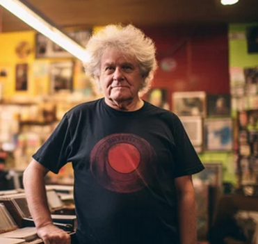

## Personas

# Persona 1 - Samantha

*Details:*
24 year old female
From Palm Springs, CA
2024 Graduate, B.A. in Chemistry and Music Minor

 
Samantha is currently traveling alone across the states to experience different musical venues to celebrate her recent graduation. She is a huge EDM / House music enjoyer that wants to experience concerts to make new experiences and friends. Even though she loves high energy situations, she is shy and has had no luck making friends with similar musical tastes. She doesn't have a car and instead uses public travel to get places making it harder to get around to meet new people.

She also wants to start things slow when meeting new people and rather not give out her phone number and social media profiles. She also would also be nice to know some people before going to the events to have somebody there for her. She wants to have the most fun she can have before settling into her career in the next year or so and make some friends along the way.

**Goals**
- Making friends locally with similar music tastes
- Sharing her favorite songs and bands
- Being able to chat easily

# Persona 2 - Steve

*Details:*
19 years young
Lives in Maryland, US.
A newly immigrated US citizen, majoring in space engineering
Currently taking class at a local college.

-
Steve usually goes for a run around 5pm then gets home, has dinner, does work and chores, then goes to bed at 10pm.
His hobbies include badminton and music while doing chores/hw.
He knows how to play guitar
After spending a few years in the US, he kinda misses his hometowns, friends,...He tries to make more friends but he finds it is difficult since he is not good at English.

**Goals**
- Finding other people around his age that share the same type of music/backgrounds.
- To be able to connect with his community in the US.
- Looking for friends to play music with.

# Persona 3 - Thomas

*Details:*
62 year old in Austin, TX
Small record store owner
No higher education

-
Tom spends most of his time running his business. Monday - Friday his business is open from 10 am to 8pm. His job allows him to socialize with a wide variety of music enjoyers in his community. He’s married and lives with his 60 year old wife. Together they have a 24 year old daughter who works as a nurse.

Tom likes to host up and coming bands in his record store on every other Friday night. However, his wife has recently brought up that this is not a profitable endeavor. Although he charges a small overhead fee to see the bands, the turnout is less than they had hoped. This isn’t harming his business, but some of the regulars have expressed their disappointment in cutting back the amount of live shows being hosted at the record store.


**Goals**
- Find local or traveling musicians to reach out to
- Advertise to fans, potential listeners, or bands
- Get feedback on local music trends and interests

## Scenarios

**Samantha**
Samantha recently arrived in Chico, CA for an upcoming music festival that she's super excited for. She would like to find some people that are also going to the same concert as her so that she can meet and get a feel of before going together. She feels like people with her similar music tastes would make excellent friends and is unsure how to reach out to and find them.

**Steve**
Steve needs some friends but he does not know where to start, he does not have a car so he can not travel far. 
He is looking for a live music location nearby within his community so that he can meet more people to befriend with.
He also wants to know if there are any peers around his area (ZIP code, address…) that share the same taste in hometown music.He is willing to meet up to play some songs together.

**Thomas**
Around closing time at the record store, Tom was approached by his assistant-manager Sarah. Sarah asks Tom if he knows of any local Jazz groups that might be around. Tom isn’t very knowledgeable about the local Jazz scene, but promises to find a group to host at the record store soon.

