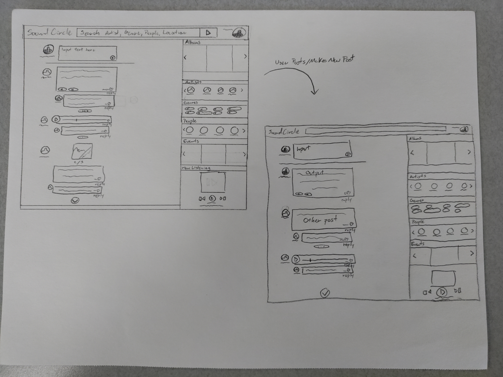

# Sketches

1. Here's our first design sketch of the SoundCircle applications main page. It displays the use of user input to create a new post and have it populate into the data feed.

Disc. As we improve it down the line, we would like to have the user view and interact to create new posts, traverse their tailored feed from friends and artists, and as well be able to view their musical interests, event opportunities, and friends list on the sidebar.

