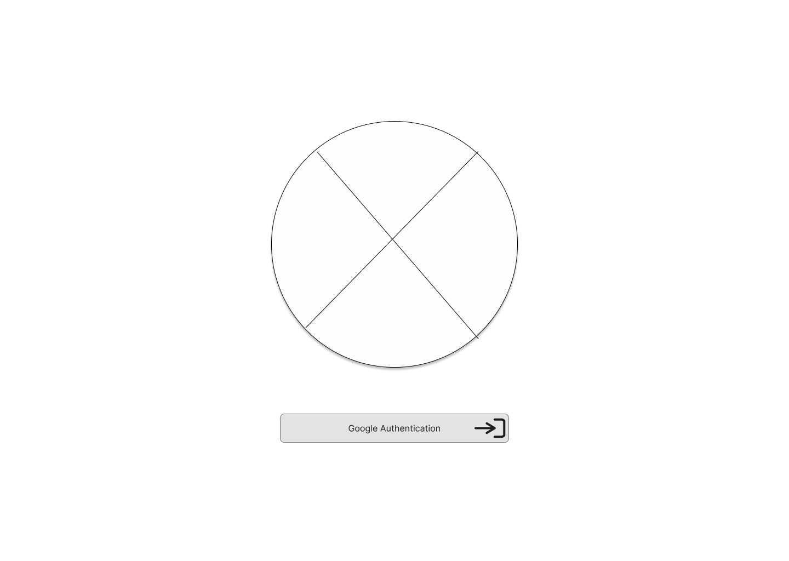
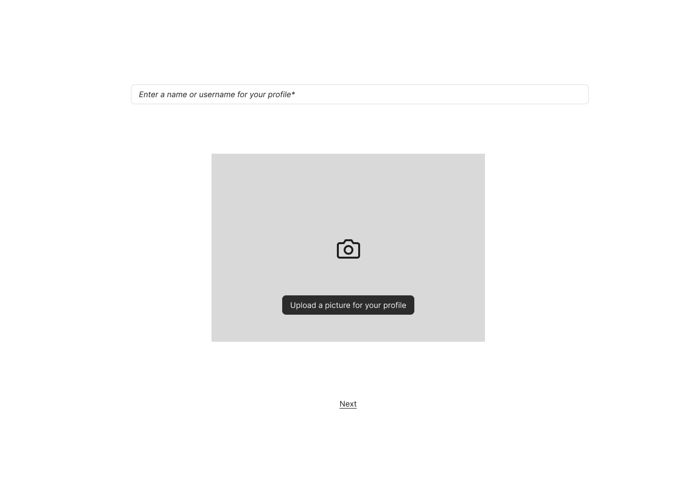
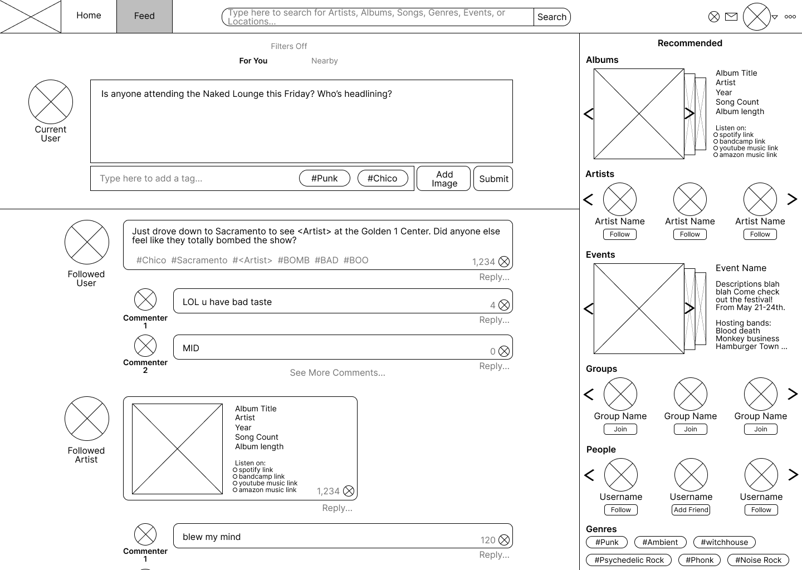
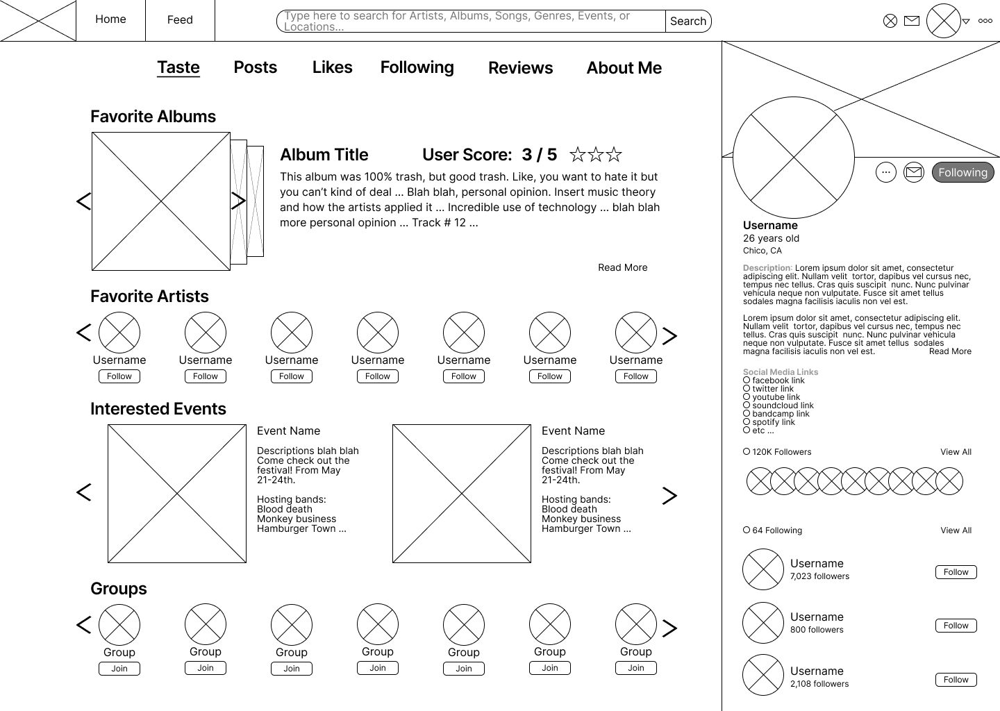

# Wireframes

## Table of Contents
1. [User Authentication and Profile Setup](#user-authentication-and-profile-setup)
2. [Search and Search Results](#search-and-search-results)
3. [User Feed](#user-feed)
4. [User Profile Pages](#user-profile-pages)

## User Authentication and Profile Setup
- **Description**: User log-in page using Google Authentication, ensuring a secure and streamlined experience.
- Steps:
  - First the user clicks on and uses Google Authentication services to log in.
  - The user is then taken to the prompt page in order to create a username and upload a user image.
  - Finally, the user is sent to the prompt page in order to (optionally) input initial likes and info.

  **Preview**: 

- **Description**: A prompt page for first time users to personalize their profile with a username and photo

  **Preview**: 

- **Description**: A simple questionnaire to customize a user's music taste and profile

  **Preview**: 

----------------------
## Search and Search Results
- **Description**: A simple user search request using the search bar
- Steps:
  - Using the search bar from any page leads to a search page.
  - The search page can then be filtered depending on user requirements / wants.

  **Preview**: 

- **Description**: User search request results filtered by adustable categories on the side

  **Preview**: 

----------------------
## User Feed
- **Description**: A users for you feed page with tailored content from a users followed artists
- Steps:
  - The input box allows users to create a new post upon pressing the submit button.
  - Posts can be filtered by nearby postings or follower posts.

  **Preview**: 

- **Description**: User feed page with a recommended near by event advertisement, using location data for personalized recommendations

  **Preview**: 

----------------------
## User Profile Pages
- **Description**: User profile page showing an unfollowed profile
- Steps:
  - By clicking the "follow" button, the local user will be able to see posts from this followed user in their "For You" feed.

  **Preview**: 

- **Description**: User profile page showing a followed profile

  **Preview**: 

