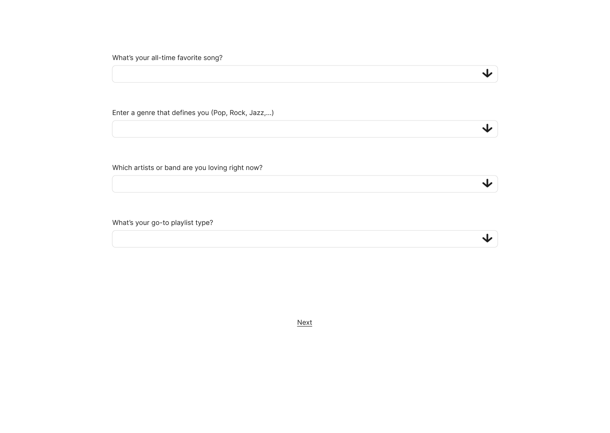
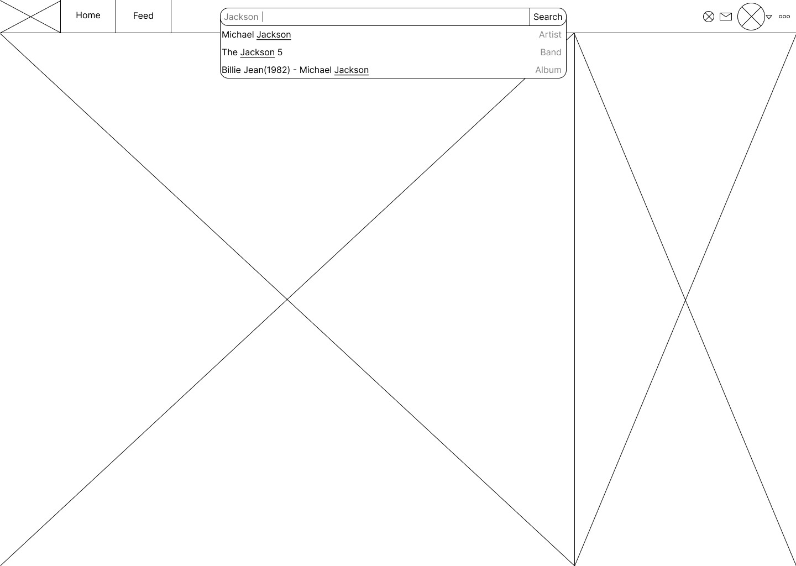
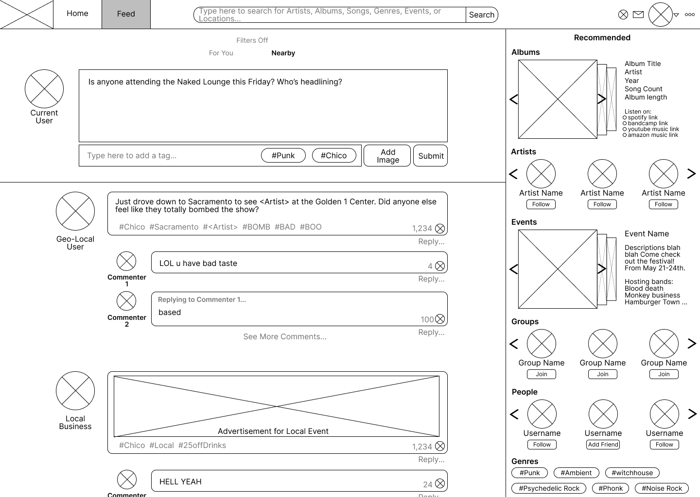

# Wireframes

Logging in Wireframes: 
* Google Authentication Page for logging in users.

* User profile prompt page with username and photo inserts sections

* User Profile questions to help fill out user music tastes

Search bar and page Wireframes: 

User feed page Wireframes: 

User profile folowing/Not-folowing Wireframes: 

